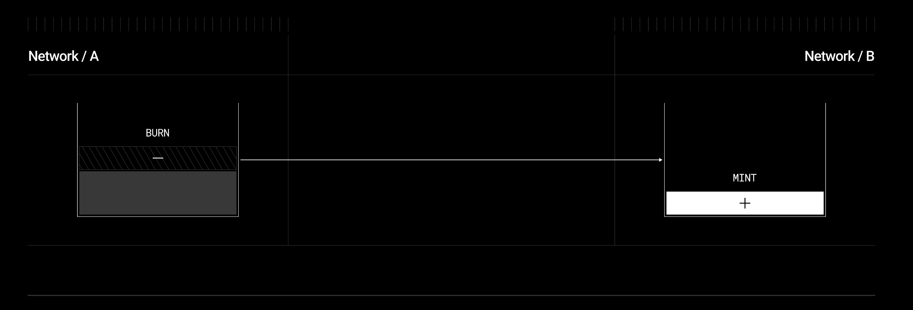

# OFT (Omnichain Fungible Token)
[reference](https://docs.layerzero.network/v2/developers/evm/oft/quickstart)


Think of EVM bridges like currency exchanges 
- they let you move assets between different chains. Traditional bridges usually work by locking tokens on one chain and minting wrapped versions on another. The problem is you have to trust that bridge to handle your assets correctly.
- LayerZero, one of the bridge protocols, takes a different approach - it's more like a messaging system between chains. Instead of directly handling assets, it just passes messages that let apps coordinate actions across chains. It uses multiple parties to verify messages instead of a single bridge operator.
- Now OFT (Omnichain Fungible Token) is a token standard built on LayerZero that makes tokens work across chains. Here's how it works in simple terms:
- When you want to send tokens from Chain A to Chain B:
  - The tokens get burned on Chain A
  - LayerZero delivers a message to Chain B saying "hey, mint X tokens to this address"
  - The OFT contract on Chain B mints new tokens
  



The cool part is both contracts share the same total supply - when you burn on one chain, you mint on another. No wrapped tokens or locked assets.
Here's a quick example of how you'd set it up:

```javascript
contract MyToken is OFT {
    constructor(
        string memory _name,
        string memory _symbol,
        address _layerZeroEndpoint
    ) OFT(_name, _symbol, _layerZeroEndpoint) {
        _mint(msg.sender, 1000000 * 10**decimals()); // Mint initial supply
    }
}
```

To use it, you just:
Deploy the same contract on both chains
Tell each contract about its counterpart using setPeer()
Users can then call send() to move tokens between chains

```javascript
// Send 100 tokens to Chain B
token.send(
    SendParam({
        dstEid: CHAIN_B_ID,  // destination chain
        to: recipientAddr,    // recipient address
        amount: 100,          // amount to send
        minAmount: 100,       // minimum to receive (for slippage)
        extraOptions: "0x"    // additional options
    }),
    fee,                      // LayerZero fee
    refundAddress            // refund address if tx fails
);
```

The main things to watch out for are:
- Setting up proper peer addresses between contracts
- Handling gas fees for cross-chain messages
- Making sure your token decimals match on both chains
  
That's OFT in a nutshell! There are also similar items like [Omnichain NFT (ONFT)](https://docs.layerzero.network/v2/developers/evm/onft/quickstart) and [Omnichain Application (OApp)](https://docs.layerzero.network/v2/developers/evm/oapp/overview). Check them out for if you are interested in more!